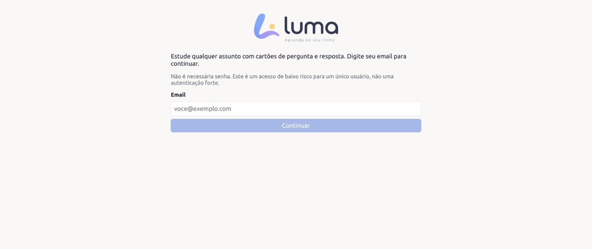
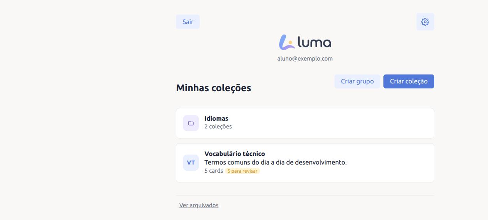
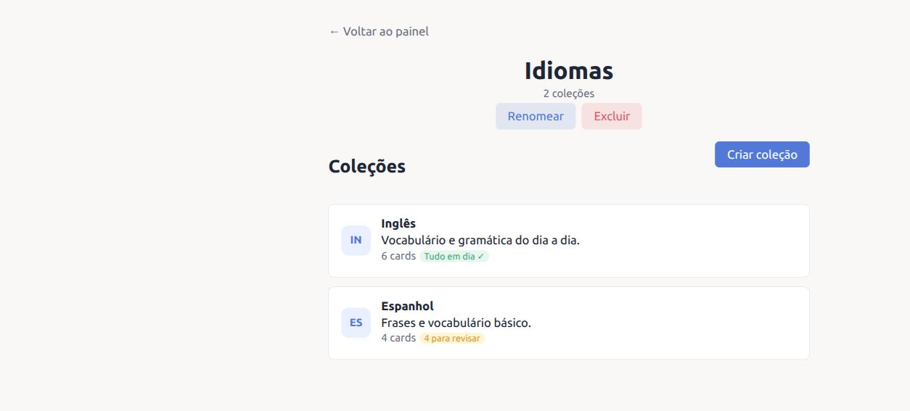
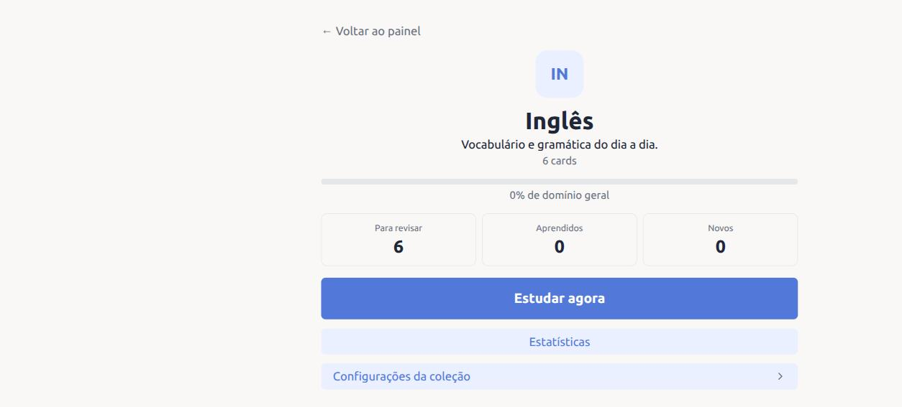
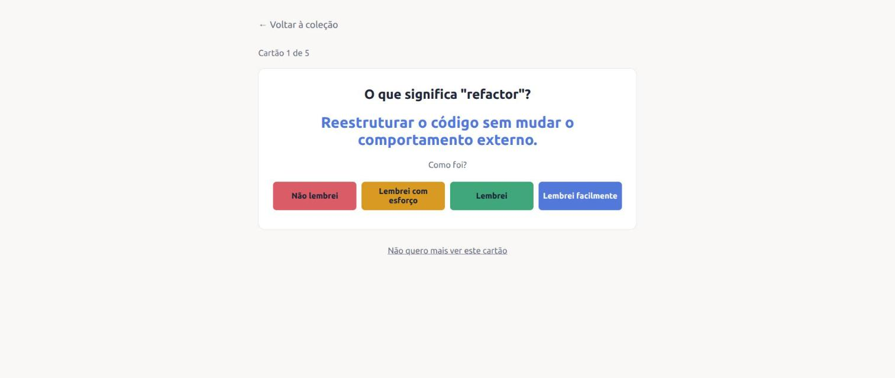
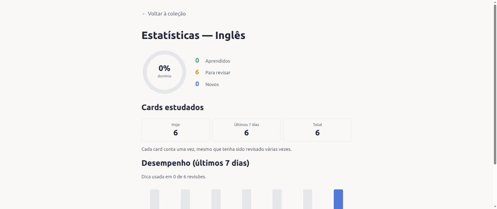
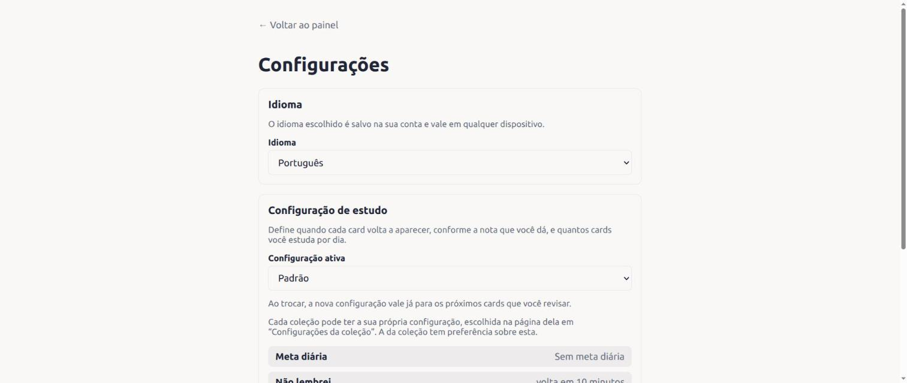

# Luma

Luma is a flashcard app for studying any subject with spaced repetition:
create collections of question-and-answer cards (with optional audio and
an extended example), study them on a schedule that adapts to how well
you remember each one, and track your progress over time. The UI is
available in Portuguese, English, Spanish and French.

Built per [`flashcard_learning_system_agent.md`](./flashcard_learning_system_agent.md)
(the spec file's own name predates the "Luma" product name); see
[`docs/DECISIONS.md`](./docs/DECISIONS.md) for everywhere the
implementation made its own call or diverged from that spec.

## Screenshots

| | |
|---|---|
|  |  |
| Email-only access — no password to set or remember. | The dashboard: collections and groups side by side, each with a status pill ("N para revisar" / "Tudo em dia ✓"). |
|  |  |
| A group holding related collections together (e.g. "Idiomas" → "Inglês", "Espanhol"). | A collection's overview: mastery, card counts, and quick actions. |
|  |  |
| Studying a card: reveal the answer, then rate how well you remembered it. | Per-collection statistics: mastery ring and the last 7 days of reviews. |
|  | |
| Settings: UI language and study configuration, both saved to the account. | |

## Features

- **Spaced repetition study**: each of the four ratings ("Não lembrei" /
  "Lembrei com esforço" / "Lembrei" / "Lembrei facilmente") reschedules a
  card differently; a better answer never comes back sooner than a worse
  one.
- **Collections and groups**: organize related collections into a
  single-level group (a folder), or leave them standalone.
- **Study configurations**: a named set of choices about how each rating
  reschedules a card, plus an optional daily card goal — one general
  configuration per user, and optionally a different one per collection.
- **Optional audio and an extended example** on any flashcard.
- **Archive and restore**: deleting a collection or card archives it
  (review history and all); archived items can be restored or permanently
  deleted later.
- **Statistics**: per-collection mastery, cards studied today/this
  week/total, and a 7-day review-performance chart.
- **Internationalized UI** (pt/en/es/fr): detects the browser's language
  on first visit, and remembers an explicit choice on the account so it
  follows you to any device.
- **Email-only access**: no password — see
  [`docs/DECISIONS.md`](./docs/DECISIONS.md) for what this trades off.
- **Daily backups** of the whole database (see
  [`docs/BACKUP.md`](./docs/BACKUP.md)).

## Tech stack

- **Backend**: Go, hexagonal/clean architecture (see
  [`backend/docs/ARCHITECTURE.md`](./backend/docs/ARCHITECTURE.md)),
  MongoDB (+ GridFS for audio).
- **Frontend**: React, TypeScript, Vite, react-i18next.
- **Infra**: Docker Compose (backend, frontend, MongoDB, a daily-backup
  sidecar), GitHub Actions CI (format/vet/build/test for both sides).

## Running locally

### With Docker Compose (recommended)

```bash
cp .env.example .env   # adjust SESSION_SECRET etc. if desired
docker compose up --build
```

- Frontend: http://localhost:5173
- Backend: http://localhost:8080/health
- MongoDB: localhost:27018 (host-only; other containers reach it at
  `mongo:27017` — 27018 avoids clashing with a MongoDB you may already
  have running locally on the default port)

Sign in with any email address (there's no password, and no verification
step — see [`docs/DECISIONS.md`](./docs/DECISIONS.md)); the account is
created the first time you use an address.

### Backend only

Requires Go 1.22+.

```bash
cd backend
go run ./cmd/api
```

### Frontend only

Requires Node.js 20+.

```bash
cd frontend
npm install
npm run dev
```

## Testing

```bash
# backend — unit tests only
cd backend && go vet ./... && go test ./...

# backend — including MongoDB integration tests
docker compose up -d mongo
cd backend && MONGODB_TEST_URI="mongodb://localhost:27018" go test ./...

# frontend
cd frontend && npm run lint && npm run build && npm test -- --run
```

MongoDB-backed tests (`internal/adapters/mongodb`, and the HTTP
integration tests in `internal/adapters/http`) skip themselves with a
clear message if no MongoDB instance is reachable, so `go test ./...`
still passes without Docker running — you just get less coverage.

## Documentation

- [`backend/docs/API.md`](./backend/docs/API.md) — full HTTP reference:
  every endpoint, request/response shapes, and the error-code/key table.
- [`backend/docs/ARCHITECTURE.md`](./backend/docs/ARCHITECTURE.md) — the
  hexagonal-architecture layering, request lifecycle, and where to add a
  new feature.
- [`docs/DECISIONS.md`](./docs/DECISIONS.md) — assumptions, trade-offs,
  and places this project deliberately diverged from the original spec.
- [`docs/BACKUP.md`](./docs/BACKUP.md) — daily backups: how they work, how
  to check and restore them.
- [`design/README.md`](./design/README.md) — brand assets and where the
  color system is defined.
- [`luma-design-agent.md`](./luma-design-agent.md) — the visual design
  system (calm/neutral palette, color tokens, terminology) the frontend
  follows.

## Configuration

See [`.env.example`](./.env.example) for all variables. Notable
defaults:

- `SESSION_SECRET` is only allowed to be empty when `APP_ENV=development`
  (an insecure placeholder is used); every other environment requires it.
- `COOKIE_SECURE` defaults to `false` in development and `true`
  otherwise.

## Known limitations

Deliberately out of scope for now — see
[`docs/DECISIONS.md`](./docs/DECISIONS.md#known-limitations-and-future-improvements)
for the full list and reasoning: no OAuth/passwordless magic links (see
"email-only access" above for what's implemented instead), no advanced
scheduler (FSRS, etc.), no exercise types beyond question → reveal-answer,
no text-to-speech, no import/export or shared collections, and no
mobile-native app.
